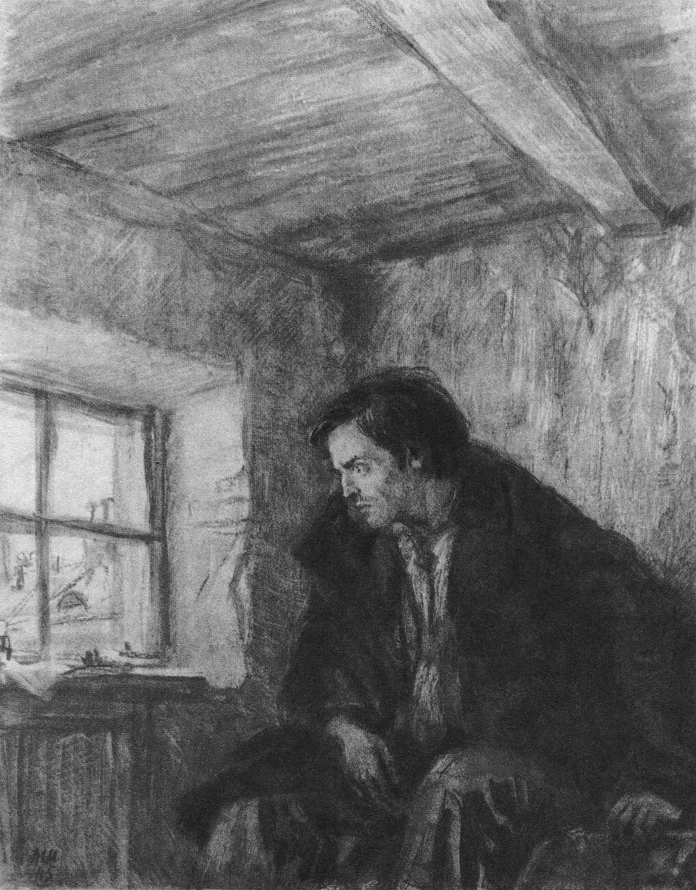
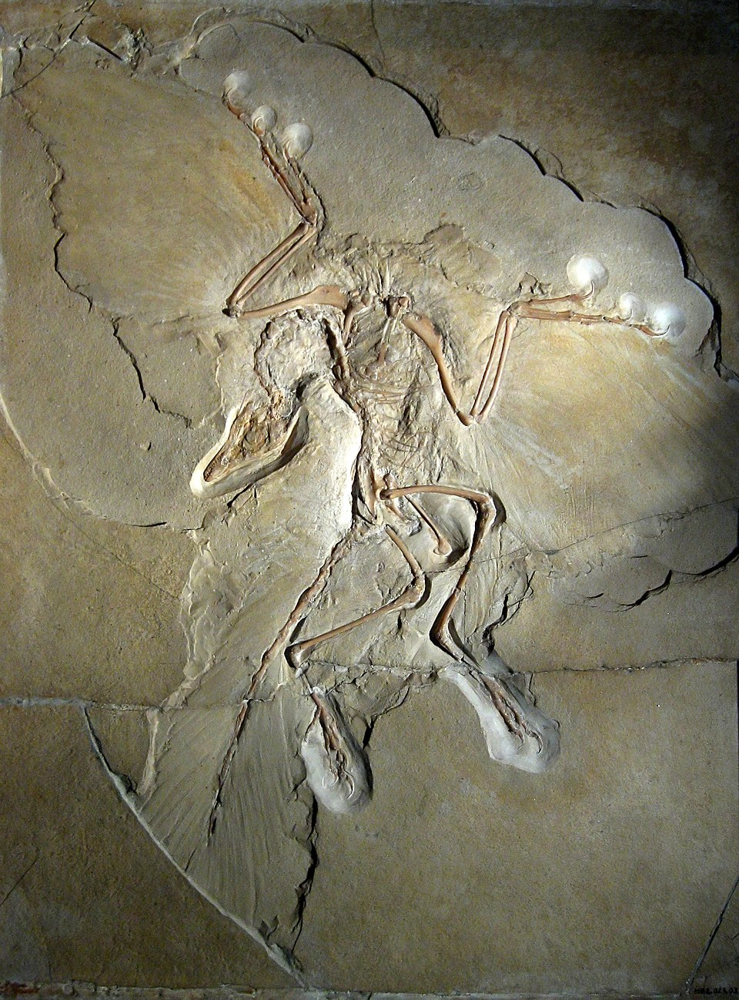
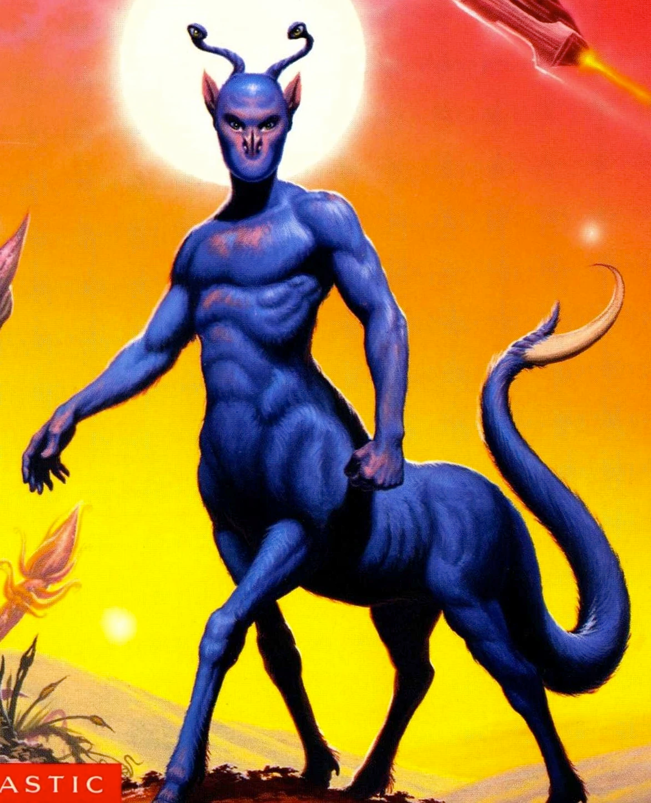

A brief review of the 67 books I read in 2025.

## Crime and Punishment by Fyodor Dostoevsky 🪓


  

    
    <figcaption style="text-align: center;">'Raskolnikov in his room' by Dementy Shmarinov (1935)</figcaption>
  



>Your worst sin is that you have destroyed and betrayed yourself for nothing.

Acutely distressing and excruciatingly detailed. Yes, Dostoevsky is as good as everyone says he is.

Explaining why you should read C&P is like trying to explain why it might be fun to read about someone beating a horse to death with a stick for 600 pages straight. 

C&P is a story about the undoing of the human psyche. In particular, the protagonist Raskolnikov's psyche after he pursues a nihilistic and destructive path that he is reluctant to follow through with yet feels obligated to endure. The first act is a fever dream of internal monologues meant to motivate Raskolnikov's nihilistic view of society, where he eventually crosses the line between being an observer of death and its harbinger. The rest of the book is a slow and methodical unravelling of his spirit as his friendships and perceptions come undone until so little of him remains that he can finally start to atone in some small way.

Not only is the prose terrifying, but the awkward translation of the Penguin classics edition (although I've been told that the original is quite awkward as well) simply adds to the ethereal nature of this book. This is demonstrated best by the jarring and feverish descriptions which pervade the story. For example: at one point, there is a scene where Raskolnikov comes across a random woman on a bridge who attempts suicide in front of him with no further context, explanation, or follow-up. Not only are many such events in the book written like they aren't quite real, but Raskolnikov's reactions to them rarely indicate that they are out of place.

I would be lying if I said that C&P is easy to get through. I took a long time to read this book and much longer than that to really understand it, but I'm really glad I did. Like Dostoevsky's other works, I'm sure this is one that requires many revisits to be fully appreciated.

## The Odyssey by Homer (translation by Richmond Lattimore) 🌊


  

    
    <figcaption style="text-align: center;">'Circe Offering the Cup to Odysseus' by John William Waterhouse (1891)</figcaption>
  



>My name is Nobody.

The Odyssey is a foundational example of the hero's journey, and has formed the basis of countless monomyth adaptations over some 2700 years. Despite its age, it is surprisingly non-linear, weaving a Christopher Nolan-esque narrative via multiple protagonists that culminate in a heroic finale. It's also totally emblematic of the beauty of the ancient Greek oral tradition marked by Homer's sweeping prose and sharp epithets. I firmly believe that anybody who finds the Odyssey boring and archaic ought to give it the chance to shine in its proper medium (or find a better translation) - that is, as an epic tale of bloody treachery rather than historic fiction with academic merit. 

Despite the dated setting, the character of Odysseus himself is hardly what you might expect. While he is undoubtedly the physical embodiment of the traditionally masculine hero archetype, his survival usually depends more on his cleverness and awareness rather than his strength, and he often cries unashamedly for his fallen comrades and estranged family.

That being said, I did find that the Odyssey stands in stark and unfortunate contrast to its predecessor, the Iliad, because it simply isn't as exciting or self-aware. Yes, the Odyssey has tragedy and occasional horror, but it doesn't hold a candle to the constant, exorbitant violence of the Iliad. Every measure of the Iliad (save for those in book 3) is in service of a buildup that culminates in a truly incredible final battle, and the story never holds back in scope or magnitude. For example: in book 21, a rage-filled Achilles slaughters his way through the Trojan army with such blatant disregard that the river god Scamander fights Achilles back as the physical manifestation of the water itself (and somehow only reaches a stalemate against him). Perhaps I'm just unsophisticated, but I find that the Odyssey's fundamentally different narrative simply never reaches the exciting highs or tragic lows within just this one book of the Iliad. Simone Weil said it best in her 1939 essay: *"L'Iliade ou le poème de la force"*.
  
## The Rise and Fall of the Dinosaurs by Steve Brusatte 🦖


  

    

    
    <figcaption>The Berlin Archaeopteryx specimen (A. siemensii)</figcaption>
    



>Let's not forget about birds - they are dinosaurs, they survived, they are still with us. The dinosaur empire may be over, but the dinosaurs remain.

I love dinosaurs. As a kid, I read just about every dinosaur book I could get my hands on, and I probably watched the Jurassic Park movies about 30 times each. 

This book (a wonderful gift from my girlfriend) takes us through the evolution of the dinosaurs, their rise to dominance, and their untimely death. Brusatte masterfully explains the geological and evolutionary milestones that shaped the world the dinosaurs lived in (which was alien in many ways to nature as we know it today) and the many facets of palaeontological research while remaining high-level enough for this to still count as a pop science book.

For anybody interested in prehistoric ecology, dinosaurs are certainly fascinating to read about; their unique biology and their dominance over the terrestrial ecosystem for ~180 million years have been the subject of countless documentaries for good reason. My favourite thing about this book is that it sent me down some fascinating rabbit holes: the incredible world of [vertebrate respiration systems](https://pressbooks.palni.org/comparativevertebrateandhumananatomy/chapter/respiratory-system/), [how birds evolved](https://www.sciencedirect.com/science/article/pii/S0960982215009458), and how [Iridium deposits from space confirmed the asteroid theory of dinosaur extinction](https://en.wikipedia.org/wiki/Iridium_anomaly).

Where this book fell short for me was Brusatte's incessant name drops and shout-outs during the story-driven human sections. While historical context is important, the minutiae and drama of biologist academia ran thin after a while. I simply wish this dinosaur book included even more about dinosaurs and less about people.
  
## Animorphs by Katherine Applegate 🐻🦅🐺🐯🦍👽


  

    

    
    <figcaption>'The Andalite Chronicles Cover Art' by Romas Kukalis (1997)</figcaption>
    



>If the choice is between being a killer and being a slave, be a killer.

I read the Animorphs series haphazardly as a teen, but never took the time to read through all 64 books until recently. Anybody who grew up in the 90s or early 2000's already knows that Animorphs was a paragon of the scholastic book fair with its absurd cover art and cheesy catchphrases. Judging these books by their covers might give you the impression that they are campy sci-fi adventures for children with limited depth.

Nothing could be further from the truth.

Despite being written for a younger audience, this series is remarkably mature and dark for one simple reason: it's a vehicle for examining the horrors of war under as many lenses as possible. It might sound silly to insist that a book series about body-snatching aliens and teenagers with superpowers is actually a tragic story about hopeless guerrilla warfare, but there is scarcely a book in this series that doesn't somehow involve innocent beings dying or people relinquishing their morals for the sake of survival. They also somehow manage to keep that theme fresh and self-aware without coming off as preachy.

Animorphs is also really, really violent. Decapitations, disembowelment, and psychological torture of children are common occurrences; while the book often circumvents any possibility of permanent physical harm to our titular protagonists via the deus ex machina of fictional alien technology, that doesn't mean that their suffering is any less palpable.

To round out the gratuitous violence, Animorphs is often heart-wrenchingly emotional and disastrously romantic. To avoid spoiling too much, suffice it to say that not everybody gets a happy ending. This was intentional; Applegate always insisted that Animorphs would never get a decisive conclusion because that's simply not the story she wanted to tell. Still, I was surprised by the depths to which she was willing to go for a series for young adults. I'm not ashamed to admit that, of the few books that have ever made me cry, half are from Animorphs alone.

Where the books sometimes fall short is when they fall into Villain-Of-The-Week-itis. The middle 20-or-so books follow a fairly regular format: the team finds out about some new plot by the enemy, they infiltrate the operation with some hijinks along the way Visser 3 (the primary antagonist for most of the series) shows up with a new morph and almost kills them, only for them to get away by the skin of their teeth. Applegate did use ghostwriters for many of the main series books, and it shows. Let's not even talk about the number of plotlines lifted straight from Star Trek, like the one time Rachel turned into a starfish and got split into two personalities.

Regardless, when these books shine, they really shine. I highly recommend Animorphs. If a science fiction multi-narrative with 90's humour and relentless introspection into wartime ethics sounds interesting to you, you should read it. If not, at least read The Andalite Chronicles; it's probably the best in the series!

