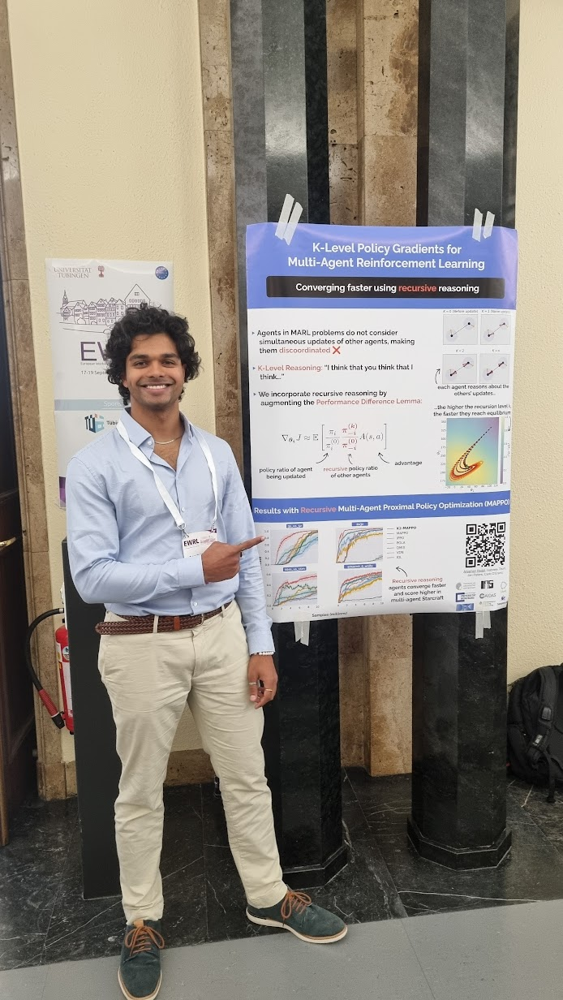
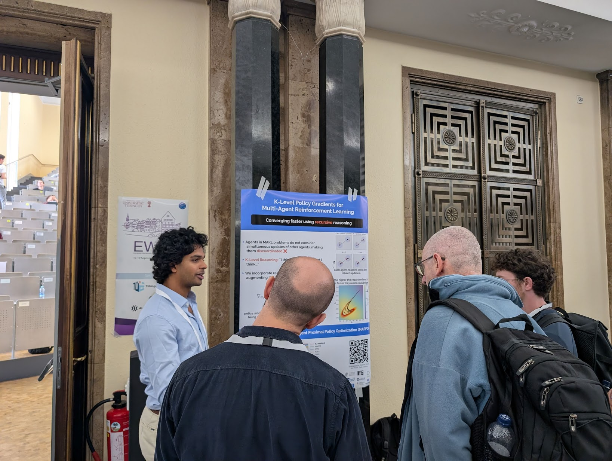
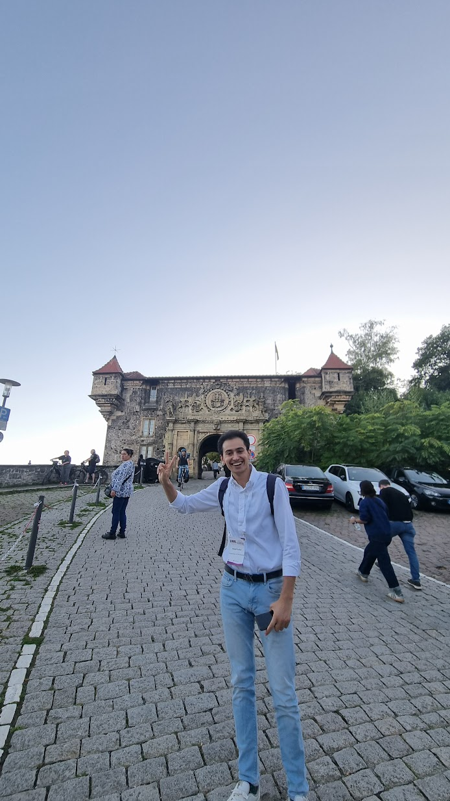
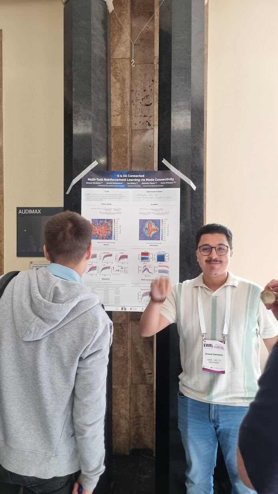
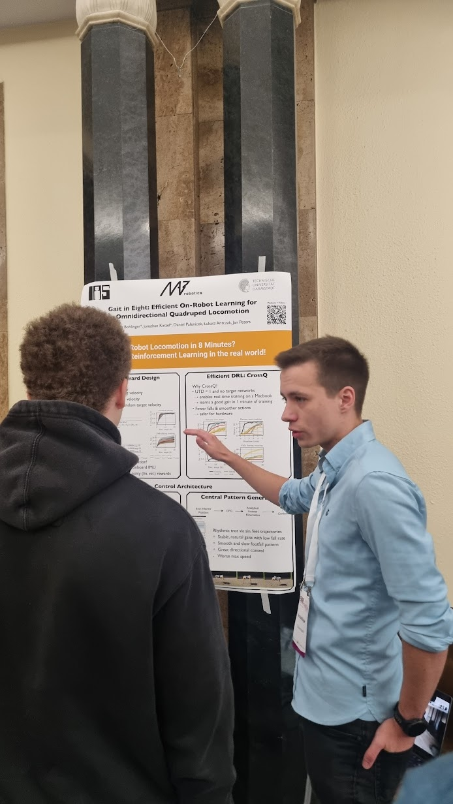

In September 2025, I went to Tübingen, Germany for the 18th European Workshop on Reinforcement Learning (EWRL). I had the chance to talk to brilliant researchers in RL and game theory from around Europe, exchange publications and preprints, and discuss the (somewhat volatile) state of machine learning research.

I also presented my preprint, [K-Level Policy Gradients for Multi-Agent Reinforcement Learning](https://arxiv.org/abs/2509.12117) as a poster, which garnered some nice attention, especially from other multi-agent RL researchers and Peter Dayan(!)


  

    

    
    <figcaption>Presenting my poster...</figcaption>
    




  

    

    
    <figcaption>
    ...to Peter Dayan</figcaption>
    




  

    

    
    <figcaption>Mahdi Kallel at the social event</figcaption>
    

    

    
    <figcaption>
    Ahmed Hendawy's poster on subspace multi-task learning</figcaption>
    

    

    
    <figcaption>
    Nico Bohlinger's poster on efficient quadruped locomotion with RL on real robots</figcaption>
    



